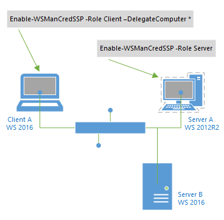

# Configuring CredSSP for use with PowerShell in Syskit Monitor

Windows Remote Management \(WinRM\) supports the delegation of user credentials across multiple remote computers. The multi-hop support functionality can use Credential Security Service Provider \(CredSSP\) for authentication. CredSSP enables an application to delegate the user’s credentials from the client computer to the target server.

CredSSP authentication is intended for environments where Kerberos delegation cannot be used. Support for CredSSP was added to allow a user to connect to a remote server and have the ability to access a second-hop machine, such as a SQL Server instance or a Domain Controller.

In some cases, a PowerShell script within Syskit Monitor may need to access resources outside the remote server machine. This requires the credentials to be delegated to the target machine.

For example, when the data from SharePoint server are retrieved and a dedicated SQL Server instance needs to be accessed or when the data from Active Directory are retrieved and an underlying Domain Controller needs to be accessed.

Use the following cmdlet to enable CredSSP on the client by specifying Client in the Role parameter.

:::warning
**Please note!**  
The command must be executed on the **application server where Syskit Monitor is installed**, and **for** the **remote server\(s\) where Syskit Monitor is executing the script**.
:::

**Enable-WSManCredSSP -Role Client –DelegateComputer \***

This policy setting allows the client to delegate explicit credentials to a remote server when server authentication is achieved. Credentials can be delegated to: **one**, **multiple** or **all** servers in a domain.

:::warning
**Please note!**  
If you want to tighten the security risk, instead of an asterisk, it is recommended to enter the FQDN of the remote server\(s\) where Syskit Monitor is executing the script.
:::

Use the following cmdlet to enable CredSSP on the remote server by specifying Server in Role parametar. It must be executed **on** the **remote server\(s\) where Syskit Monitor is executing the script**.

**Enable-WSManCredSSP -Role Server**

This policy setting allows the remote server to act as a delegate for clients, permitting it to use delegated credentials.

The use of these two commands is shown in the image below.

